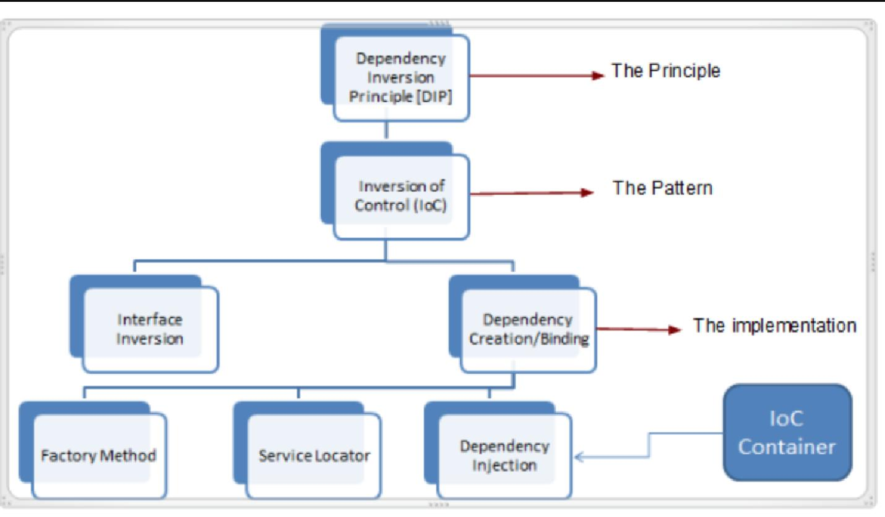

= 0214필기

== 복습
* 프레임워크를 사용하는 이유: 골격 제공 -> 비즈니스 로직에 집중, OOP에 집중하기 쉽도록 함
* IOC: 코드흐름, 객체의 생명주기를 모두 프레임워크에 맡김.
* template method 디자인패턴 = IOC를 구현하기 위한 방법론 중 하나

[,java]
----
 public static void main(String[] args) {
        new ComplexGreetingService().greet();
    }

// ComplexGreetingService 내부에서 생성한 객체를 사용한다.
    public boolean greet() {
        return new KoreanGreeter().sayHello();
    }
----
위 코드는 좋지 않음, 의존성을 아래 코드에서 직접 만들고 있기 때문

[,java]
----
void afterPropertiesSet() throws Exception;
public class someClass implements InitializingBean
----
위의 구현은 비침투성은 감소하나, 실제로는 많이 쓴다.

* protype bean: 소멸자를 스프링에서 제공하지 않음, 리소스 이슈/ 예측 불가능성
(생성에서 리소스 소모, 언제 소멸될지 프레임워크 입장에서는 알지 못하므로 추가 리소스 소모 억제)
* 반면 singleton bean은 충분히 예측 가능하다.

== 의존성주입
* 의존성을 없애는 과정임
* messagesender 실습으로 이해하자면, messagesender 인터페이스에만 의존하고 하위 구현클래스와의 의존은 감소시키기 위함
* IOC 구현 방법론 중 하나. 코드의 확장성을 높인다

DIP 원칙을 지키기 위해 IOC패턴을 사용하고, IOC패턴을 구현하는 방법이
인터페이스/의존성 생성 후 주입이고, 의존성 주입을 위해 사용하는 방법이 하위 3개이다.

* 상위 모듈이 하위 모듈에 의존관계를 가지지 않도록 구현해야 합니다.
추상클래스는 그 구현체의 내용에 의존관계를 가지지 않는다.
구현체가 추상클래스에 의존관계를 가질 수 있다.
* 의 3가지 원칙을 지키도록 한다.
* factory method 디자인패턴 =  DIP를 지키기 위한 방법론 중 하나, 팩토리가 아닌 팩토리 메소드가 본체이다.
* 의존성 주입 정의: "프로그래밍에서 구성 요소(대부분 bean)간의 의존관계가 소스코드 내부가 아닌
외부의 설정파일 등을 통해 정의되도록 하는 디자인 패턴 중의 하나"

== annotation 사용한 의존성주입
* @Required 어노테이션 사용하지 않는 이유
----
public @interface Autowired {
    boolean required() default true;
}
----
autowired 어노테이션 안에 이 설정값 (기본값 true)을 사용하기 때문

* @Autowired 어노테이션 역시 xml설정과 같이 setter, constructor, field 에 붙일 수 있다.
* 정확히는 @Target 어노테이션에 정의된 필드에 붙일 수 있다.
* 권장은 생성자에 붙이는 것

* @Value annotation
* src/main/resource 디렉토리, greeting.properties 파일 내부에 from=Manty 와 같이 key-value 형식으로 저장된 경우
----
<beans>
  ....
  <context:property-placeholder location="classpath:greeter.properties" />
</beans>
----
와 같이 bean으로 등록하면
----
    @Value("${from}")
    private String from;
----
으로 key-value 값처럼 사용할 수 있다.(실제로 그렇게 저장된다.)
* @Value 어노테이션 변수의 경우 클래스를 직접 만들어서 쓰면 항상 null이다. 오직 프레임워크에 의해 bean으로 생성될 때만 읽어진다.

* 어노테이션과 xml
** 어노테이션이 가독성, 편의성이 매우 좋으며 자바와 동일한 문법을 써서 배우기 쉽다.
** 다만 스프링 프레임워크에 대한 의존성이 발생한다.

== javaconfig
* xml 파일 대신 자바로만 설정하도록 함
* @Configuration 어노테이션이 붙은 클래스는 bean 생성 코드들이 들어가야 한다.

